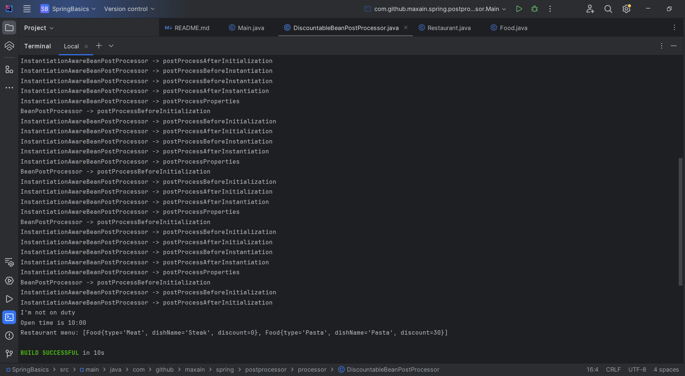

## Проект для изучения основ Spring

### Описание

Проект для изучения `Spring Core`. В каждом пакете `spring`
отдельное приложение для изучения базовых понятий.

### Стэк

- `Java`  - 17
- `Gradle`  - 8.4
- `Spring framework`  - 6.1.0
- `JUnit`  - 5.9.1
- `Jakarta`  - 2.1.1

### Структура

```text
└── spring
    ├── basic # Базовые классы и аннотации для запуска приложения
    ├── di # Dependency injection
    ├── scope # Scopes
    ├── lifecycle # Bean's lifecycle
    ├── aware # Aware interfaces
    └── postprocessor # Bean's postprocessors
```

### Команды :
```bash
./gradlew run # Запуск метода из класса "di" (По умолчанию для таски "run")
./gradlew run -PmainClass="com.github.maxain.spring.scope.RestaurantApplication" # Запуск метода из класса "scope"
./gradlew run -PmainClass="com.github.maxain.spring.lifecycle.Main" # Запуск из пакета "lifecycle"
./gradlew run -PmainClass="com.github.maxain.spring.aware.Main" # Запуск из пакета "aware"
./gradlew run -PmainClass="com.github.maxain.spring.postprocessor.Main" # Запуск из пакета "postprocessor"
```

### Версии `Java` и `Gradle`

Для того , чтобы изменить версию `Java`:

Скачать `JDK` и указать путь `JAVA_HOME` в переменных окружения
(Пример для `PowerShell`)

```text
$env:JAVA_HOME = "C:\Program Files\Java\jdk-22"
```

Для того , чтобы изменить версию `Gradle`:

В файле `gradle-wrapper.properties` указать актуальную версию `Gradle` (8.6+)

```text
distributionUrl=https\://services.gradle.org/distributions/gradle-8.6-bin.zip
```

Или выполнить комманду :

```bash
./gradlew wrapper --gradle-version=8.6
```

### Первый запуск класса в пакете `basic`: 


### Dependency injection:


### Scopes


### Жизненный цикл бина :


### Инициализация бина:


### Application with Bean's postprocessors (package - postprocessor)



### Документация:
- [Gradle](https://docs.gradle.org/current/userguide/userguide.html)
- [JUnit](https://junit.org/junit5/docs/current/user-guide/)
- [Spring framework](https://docs.spring.io/spring-framework/reference/overview.html)
- [Jakarta](https://jakarta.ee/learn/docs/jakartaee-tutorial/current/index.html)

### Автор - Калугин Максим